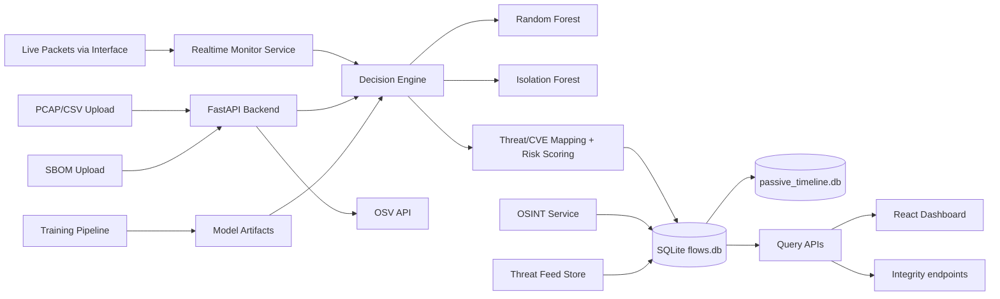

# System Architecture

## Architecture Summary

The project is a multi-component security analytics stack:

- `nal/backend`: FastAPI service exposing all APIs and orchestrating ML inference.
- `nal/core`: shared feature preprocessing functions used by training/inference.
- `nal/training_pipeline`: artifact generation for Random Forest, Isolation Forest, scaler, and metadata.
- `nal/frontend`: React/Vite dashboard consuming backend APIs.
- Integrity and observability endpoints for runtime/system checks.
- Root runtime storage: `flows.db` (flow/history) and `passive_timeline.db` (passive dashboard timeline) plus temporary upload/processing folders.

## Component Responsibilities

### 1) Backend API and Orchestration
- Entry point: `nal/backend/app/main.py`.
- Exposes endpoints for health, traffic, anomalies, history, uploads, realtime, threat feed status, OSINT flow validation, model metrics, and SBOM.
- Delegates inference to `decision_service`, live capture to `realtime_service`, storage to `db.py`, OSINT routes to `osint_routes.py`, threat feed lifecycle to `threat_feeds.py`, and dependency scanning to `sbom_service`.

### 2) Decision Engine
- File: `nal/backend/app/services/decision_service.py`.
- Loads artifacts from `nal/training_pipeline/models`.
- Converts PCAP/PCAPNG to CSV via `cicflowmeter` if needed.
- Cleans/aligned features, applies scaler/model inference, computes risk, threat type, CVE context, and explanatory text.

### 3) Data Persistence
- File: `nal/backend/app/db.py`.
- SQLite schema and stores:
  - `flows` table: per-flow telemetry and inferred security context.
  - `analysis_history` table: per-analysis metadata.
- `passive_timeline.db`:
  - `passive_upload_points` table for passive timeline chart points used by dashboard.
- Implements filtering, pagination, trend aggregation, and monitor-type partitioning (`passive` vs `active`).

### 4) Realtime Capture
- File: `nal/backend/app/services/realtime_service.py`.
- Scapy packet sniffing loop in background thread.
- Packet-to-flow aggregation computes CIC-like feature set.
- Reuses same decision logic (`classify_flows`) as passive path.

### 5) OSINT Enrichment and Validation
- Files: `nal/backend/app/services/osint.py`, `nal/backend/app/osint_routes.py`.
- Enriches anomalous/public-IP flows with AbuseIPDB + VirusTotal checks (with caching/retry logic).
- Persists OSINT fields on flow rows and exposes filtered retrieval endpoint: `/api/osint/flows`.

### 6) Threat Feed Subsystem
- File: `nal/backend/app/services/threat_feeds.py`.
- Starts in background at backend boot (`threat_feed_store.start_background_refresh()`).
- Serves feed state through `/api/threat-feeds/status`.

### 7) ML Training Pipeline
- Files: `nal/training_pipeline/train.py`, `nal/core/feature_engineering.py`, scripts under `nal/training_pipeline/scripts`.
- Trains:
  - `RandomForestClassifier` (supervised),
  - `IsolationForest` (unsupervised).
- Saves: models, scaler, label encoder, feature names, and `metrics.json`.

### 8) Frontend
- File roots: `nal/frontend/src`.
- Routing in `App.jsx`; API client in `src/services/api.js`.
- Pages for dashboard, upload, active monitoring, anomalies, history/reporting, traffic analysis, model metrics, and SBOM security.

### 9) Integrity and Observability
- `GET /api/model/integrity` validates model artifact presence and compatibility.
- `GET /api/integrity` runs import, DB, route, and model checks.

## Architecture Diagram

## Tech Stack by Component

- Backend/API: FastAPI, Uvicorn, Pydantic, SQLite (`sqlite3`), Pandas, NumPy.
- ML: scikit-learn (RandomForest, IsolationForest), StandardScaler, LabelEncoder, joblib/pickle artifacts.
- Packet and flow handling: Scapy + CICFlowMeter.
- Frontend: React 18, Vite, Axios, Chart.js, TailwindCSS.
- SBOM/security: cyclonedx-python-lib, OSV API, dependency parser utilities.
- Containerization: Docker + docker-compose for backend/frontend services.
