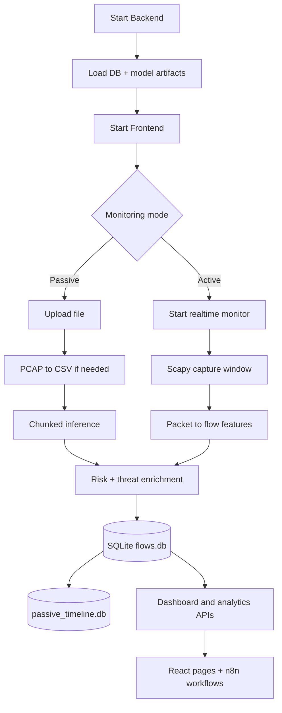

# Execution Guide

## Recommended Run Order

1. Train models (optional but recommended for supervised classification quality).
2. Start backend API.
3. Start frontend.
4. (Optional) start n8n workflows.
5. (Optional) enable active monitoring.

## 1) Train Models

```bash
cd /home/ictd/Desktop/Network/nal
source .venv/bin/activate
python training_pipeline/train.py
```

Expected artifact outputs:

- `training_pipeline/models/supervised/rf_model.pkl`
- `training_pipeline/models/unsupervised/if_model.pkl`
- `training_pipeline/models/artifacts/scaler.pkl`
- `training_pipeline/models/artifacts/label_encoder.pkl`
- `training_pipeline/models/artifacts/feature_names.pkl`
- `training_pipeline/models/metrics.json`

## 2) Start Backend

```bash
cd /home/ictd/Desktop/Network/nal
source .venv/bin/activate
uvicorn backend.app.main:app --host 0.0.0.0 --port 8000 --reload
```

For live packet capture:

```bash
sudo /home/ictd/Desktop/Network/nal/.venv/bin/python -m uvicorn backend.app.main:app --host 0.0.0.0 --port 8000
```

Why `sudo` is needed: active monitoring uses Scapy `sniff()` on interfaces, which typically requires elevated privileges.

## 3) Start Frontend

```bash
cd /home/ictd/Desktop/Network/nal/frontend
npm run dev -- --host
```

Open `http://localhost:5173`.

## End-to-End Runtime Flow (Actual)



## 4) Use Main Functional Paths

- Upload analysis: UI `Upload` page or `POST /api/upload`.
- Active monitoring: UI `Active Monitoring` page or realtime endpoints.
- Threat triage: `Anomalies`, `Traffic Analysis`, and `History` pages.
- SBOM: upload dependency file in `SBOM Security` page.

## 5) n8n Workflows

- Start n8n (`docker compose` service or standalone).
- Import workflows from `nal/n8n/*.json`.
- Configure webhook URLs and backend URL.
- Activate selected workflows.

## 6) Active Monitoring Detailed Run Steps

1. Start backend with `sudo`.
2. Open `Active Monitoring` page.
3. Select interface (`lo` recommended for local testing) and click `Start`.
4. Backend starts daemon thread and loops every ~5 seconds:
   - capture packets (`sniff`),
   - group into normalized 5-tuple flows,
   - compute CIC-style feature vectors,
   - run `classify_flows()` with same RF/IF logic as upload mode,
   - insert rows with `monitor_type='active'`.
5. Check:
   - `/api/realtime/status` (`running`, `capture_count`, `last_flow_count`, `capture_error`)
   - `/api/dashboard/stats?monitor_type=active` for active-only metrics.

## 7) ML Runtime Verification Commands

```bash
curl http://localhost:8000/api/models/metrics
curl http://localhost:8000/api/classification/criteria
curl "http://localhost:8000/api/realtime/status"
```

## Quick API Verification

```bash
curl http://localhost:8000/api/health
curl http://localhost:8000/api/dashboard/stats
```
