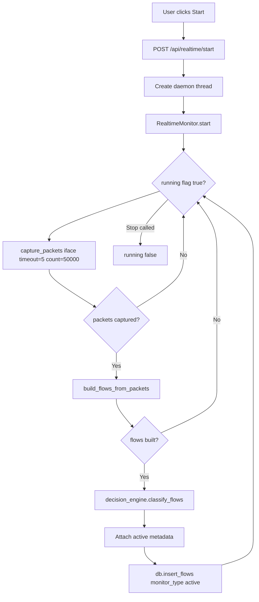

# Live Monitoring Deep Dive

## Purpose

Live Monitoring is the active-capture mode that continuously sniffs packets from a network interface, converts packet streams into flow features, applies the same ML decision engine used by file uploads, and stores results in SQLite as `monitor_type='active'`.

Core implementation:

- API control routes: `backend/app/main.py`
- Runtime loop and packet/flow engineering: `backend/app/services/realtime_service.py`
- Inference and risk logic: `backend/app/services/decision_service.py`
- Persistence: `backend/app/db.py`

## Control Endpoints

- `POST /api/realtime/start?interface=<iface>`
- `POST /api/realtime/stop`
- `GET /api/realtime/status`
- `GET /api/realtime/interfaces`

## Live Monitoring Runtime Flow

## Packet Capture Behavior

In `capture_packets(interface, duration=5)`:

- Uses `scapy.sniff`.
- Default interface fallback is `lo` when not provided.
- Max packets per window: `50000`.
- If selected interface is invalid, tries default capture (`iface=None`).
- Capture errors are throttled and exposed via `capture_error` in status response.

## How Packets Become Flows

`build_flows_from_packets()` does:

1. Accept only IP/IPv6 packets with TCP/UDP/ICMP.
2. Extract src/dst IP, ports, protocol number, timestamp, lengths, and TCP flags.
3. Normalize direction using tuple ordering so both directions map to one flow key.
4. Aggregate lists and counters per flow:
   - packet lengths (forward/backward/all),
   - timestamps and IATs,
   - header lengths,
   - TCP flags (`FIN`, `SYN`, `RST`, `PSH`, `ACK`, `URG`, `ECE`, `CWR`),
   - initial TCP window sizes.
5. Compute CIC-style derived metrics:
   - rates (`flow_byts_s`, `flow_pkts_s`, `fwd_pkts_s`, `bwd_pkts_s`),
   - totals (`tot_fwd_pkts`, `tot_bwd_pkts`, `totlen_*`),
   - min/max/mean/std/variance for packet lengths and IATs,
   - segmentation/subflow/window/ratio features.

Result: per-flow dict compatible with `DecisionEngine.classify_flows()`.

## ML Prediction Path in Live Mode

After flow build:

1. `classify_flows()` aligns features to `feature_names.pkl`.
2. Applies `StandardScaler`.
3. Runs RF prediction + confidence (if available).
4. Runs IF anomaly prediction + anomaly scoring.
5. Applies unsupervised override for BENIGN+anomaly cases.
6. Calculates risk score and maps to risk levels:
   - `Critical > 0.8`
   - `High > 0.6`
   - `Medium > 0.3`
   - else `Low`
7. Adds threat type, CVE refs, and explanation string.

## Live Monitoring Status Fields

`GET /api/realtime/status` includes:

- `running`
- `interface`
- `capture_count`
- `last_flow_count`
- `capture_error` (if any)
- `flow_counts` (active/passive totals injected by main API layer)

## Data Written to DB

Inserted rows include:

- flow network fields (IPs, ports, protocol, durations, rates, packet totals),
- ML fields (`classification`, `confidence`, `anomaly_score`, `risk_score`, `risk_level`, `is_anomaly`),
- explainability fields (`threat_type`, `cve_refs`, `classification_reason`),
- `monitor_type='active'`,
- `upload_filename='realtime'`,
- timestamp set at insertion time.

## Operational Requirements and Gotchas

- Backend should be started with `sudo` for packet sniffing.
- Wrong interface selection causes empty capture or fallback behavior.
- In low-traffic environments, active flow count can remain 0 until traffic is generated.
- If model artifacts are missing, active mode still works but behaves closer to anomaly-only detection.

## Quick Verification Sequence

1. Start backend with `sudo`.
2. `POST /api/realtime/start?interface=lo`
3. Generate traffic (open dashboard, run local network requests).
4. `GET /api/realtime/status` -> ensure counters increase.
5. `GET /api/dashboard/stats?monitor_type=active` -> verify active flow ingestion.
6. Stop with `POST /api/realtime/stop`.
